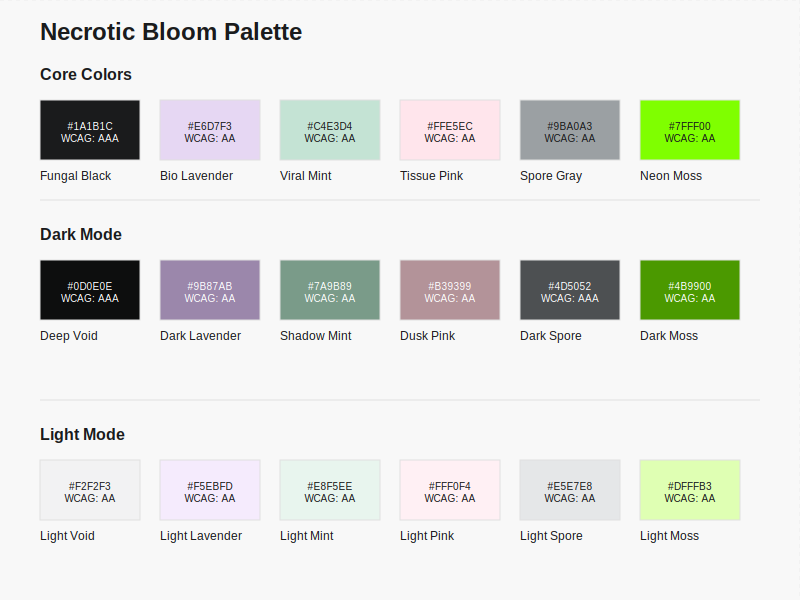

# Necrotic Bloom


> A Pastel Gothic Biopunk Color System for Modern Interfaces

<div align="center">
  
</div>

This color system emerged from a design prompt seeking to merge three distinct aesthetic elements:
1. Pastel softness
2. Gothic darkness
3. Biopunk organic/synthetic fusion

The name "Necrotic Bloom" captures the essence of this palette - the interplay between decay and growth, synthetic and organic, soft and harsh. Like a beautiful fungus growing on decaying matter, or a neon-bright chemical reaction in a dark laboratory, these colors tell a story of life finding new forms in unexpected places.

## Color Specifications

### Core Colors

| Color Name    | Hex Code | Description | WCAG |
|--------------|----------|-------------|------|
| Fungal Black | `#1A1B1C` | Primary dark tone, deep cave fungus | AAA |
| Bio Lavender | `#E6D7F3` | Soft purple with bioluminescent qualities | AA |
| Viral Mint   | `#C4E3D4` | Clinical green with organic undertones | AA |
| Tissue Pink  | `#FFE5EC` | Soft organic matter pink | AA |
| Spore Gray   | `#9BA0A3` | Neutral gray with organic qualities | AA |
| Neon Moss    | `#7FFF00` | Vibrant toxic growth accent | AA |

### Dark Mode Variations

| Color Name    | Hex Code | Description | WCAG |
|--------------|----------|-------------|------|
| Deep Void    | `#0D0E0E` | Darker background state | AAA |
| Dark Lavender| `#9B87AB` | Muted purple for dark contexts | AA |
| Shadow Mint  | `#7A9B89` | Desaturated green for dark contexts | AA |
| Dusk Pink    | `#B39399` | Muted pink for dark contexts | AA |
| Dark Spore   | `#4D5052` | Deeper gray for dark contexts | AAA |
| Dark Moss    | `#4B9900` | Darker accent for dark contexts | AA |

### Light Mode Variations

| Color Name     | Hex Code | Description | WCAG |
|---------------|----------|-------------|------|
| Light Void    | `#F2F2F3` | Light background state | AA |
| Light Lavender| `#F5EBFD` | Higher contrast purple for light contexts | AA |
| Light Mint    | `#E8F5EE` | Higher contrast green for light contexts | AA |
| Light Pink    | `#FFF0F4` | Higher contrast pink for light contexts | AA |
| Light Spore   | `#E5E7E8` | Lighter gray for light contexts | AA |
| Light Moss    | `#DFFFB3` | Lighter accent for light contexts | AA |

## Design Philosophy

The palette takes inspiration from several sources:
- Laboratory specimens preserved in soft-hued solutions
- Bioluminescent organisms in dark environments
- Pastel goth fashion's subversion of traditional dark themes
- Clinical cleanliness meeting organic growth
- The duality of synthetic biology - both beautiful and unsettling

## Usage Guidelines

### Primary Applications
- User Interfaces
- Digital Art
- Website Design
- Game Design
- Scientific/Medical Applications
- Biotechnology Branding

### Color Relationships

1. Base System
   - Fungal Black serves as the foundation
   - Pastel tones (Lavender, Mint, Pink) provide organic softness
   - Neon Moss offers crucial moments of intensity
   - Spore Gray bridges the gap between dark and light elements

2. Dark Mode
   - Deeper saturation maintains theme while ensuring readability
   - Reduced brightness preserves the gothic aesthetic
   - Maintains color relationships while adapting to darker contexts

3. Light Mode
   - Higher contrast while maintaining the soft, clinical feel
   - Preserves the biopunk aesthetic in well-lit contexts
   - Ensures accessibility without losing character

### Accessibility Considerations

- Core colors maintain sufficient contrast for text readability
- Light and dark variations ensure flexibility across different contexts
- Accent colors (Neon Moss family) reserved for important highlights
- Gray tones carefully calibrated for subtle hierarchy

## Implementation Examples

```css
:root {
  /* Core Colors */
  --fungal-black: #1A1B1C;
  --bio-lavender: #E6D7F3;
  --viral-mint: #C4E3D4;
  --tissue-pink: #FFE5EC;
  --spore-gray: #9BA0A3;
  --neon-moss: #7FFF00;
  
  /* Dark Mode Colors */
  --deep-void: #0D0E0E;
  --dark-lavender: #9B87AB;
  --shadow-mint: #7A9B89;
  --dusk-pink: #B39399;
  --dark-spore: #4D5052;
  --dark-moss: #4B9900;
  
  /* Light Mode Colors */
  --light-void: #F2F2F3;
  --light-lavender: #F5EBFD;
  --light-mint: #E8F5EE;
  --light-pink: #FFF0F4;
  --light-spore: #E5E7E8;
  --light-moss: #DFFFB3;
}

/* Example Usage */
body {
  background-color: var(--light-void);
  color: var(--fungal-black);
}

.dark-theme {
  background-color: var(--deep-void);
  color: var(--light-spore);
}

.accent-button {
  background-color: var(--neon-moss);
  color: var(--fungal-black);
}

.card {
  background-color: var(--bio-lavender);
  border: 1px solid var(--spore-gray);
}
```

## Notes on Inspiration

This color scheme draws from the growing intersection of biotechnology and design, where sterile laboratory environments meet organic processes. It acknowledges both the beauty and slight unease of synthetic biology, creating a space where the natural and artificial coexist in aesthetic harmony.

The pastel elements soften what could otherwise be harsh contrasts, while the darker tones ground the palette in its gothic roots. The result is a versatile system that can adapt to various contexts while maintaining its unique character - much like the adaptable organisms that inspired it.

## Quick Start

### NPM Installation
```bash
npm install necrotic-bloom
```

### CDN Usage
```html
<link rel="stylesheet" href="https://unpkg.com/necrotic-bloom@1.0.0/dist/necroticBloom.css">
```

### Direct Download
Download the [latest release](https://github.com/yourusername/necrotic-bloom/releases) and include in your project.

## Contributing

1. Fork the repository
2. Create your feature branch (`git checkout -b feature/amazing-feature`)
3. Commit your changes (`git commit -m 'Add some amazing feature'`)
4. Push to the branch (`git push origin feature/amazing-feature`)
5. Open a Pull Request

## License

This project is licensed under the MIT License - see the [LICENSE](LICENSE) file for details.

## Acknowledgments

- Inspired by biopunk aesthetics and laboratory specimens
- WCAG accessibility guidelines
- The growing intersection of biotechnology and design

## Support

- 📫 [Report a bug](https://github.com/yourusername/necrotic-bloom/issues)
- 💡 [Request a feature](https://github.com/yourusername/necrotic-bloom/issues)
- 📖 [Documentation](https://github.com/yourusername/necrotic-bloom/wiki)
