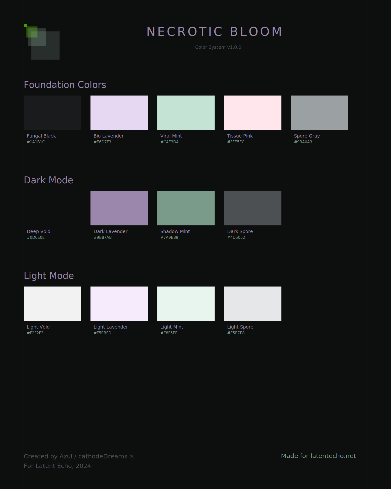

# Necrotic Bloom Color System



A biopunk color system designed for Latent Echo

## Color Architecture

### Foundation Colors (Base Palette)
| Color Name    | Hex Code | RGB           | HSL                  | Usage                |
|--------------|----------|---------------|----------------------|----------------------|
| Fungal Black | `#1A1B1C` | 26, 27, 28   | 210°, 4%, 11%       | Primary Text        |
| Bio Lavender | `#E6D7F3` | 230, 215, 243| 270°, 53%, 90%      | Secondary Accent    |
| Viral Mint   | `#C4E3D4` | 196, 227, 212| 150°, 38%, 83%      | Success States      |
| Tissue Pink  | `#FFE5EC` | 255, 229, 236| 348°, 100%, 95%     | Warning/Error       |
| Spore Gray   | `#9BA0A3` | 155, 160, 163| 204°, 3%, 62%       | Disabled States     |
| Neon Moss    | `#7FFF00` | 127, 255, 0  | 90°, 100%, 50%      | Primary Action      |

### Extended Shades - Dark Mode
| Color Name     | 100 (Darkest) | 200        | 300        | 400 (Base)  | 500        |
|---------------|--------------|------------|------------|-------------|------------|
| Void          | `#000000`    | `#050606`  | `#0A0B0B`  | `#0D0E0E`   | `#1A1B1C`  |
| Lavender      | `#2D2833`    | `#574E63`  | `#796E8B`  | `#9B87AB`   | `#BBA5CB`  |
| Mint          | `#233029`    | `#445C50`  | `#607F6E`  | `#7A9B89`   | `#96B7A5`  |
| Spore         | `#1A1B1C`    | `#333537`  | `#404244`  | `#4D5052`   | `#666A6D`  |
| Moss          | `#162000`    | `#2B4700`  | `#3B6300`  | `#4B9900`   | `#5BB300`  |

### Extended Shades - Light Mode
| Color Name     | 500         | 400         | 300 (Base)  | 200         | 100 (Lightest) |
|---------------|-------------|-------------|-------------|-------------|----------------|
| Void          | `#999999`   | `#CCCCCC`   | `#F2F2F3`   | `#F7F7F8`   | `#FFFFFF`      |
| Lavender      | `#D1C1E1`   | `#E3D6F0`   | `#F5EBFD`   | `#F8F2FE`   | `#FAF6FE`      |
| Mint          | `#CFE9DC`   | `#DBF1E5`   | `#E8F5EE`   | `#F0F9F4`   | `#F5FBF8`      |
| Spore         | `#C4C7C9`   | `#D4D7D8`   | `#E5E7E8`   | `#ECEEF0`   | `#F4F5F6`      |
| Moss          | `#B3FF66`   | `#CCFF99`   | `#DFFFB3`   | `#E6FFCC`   | `#F2FFE6`      |

### Semantic Colors
| Purpose       | Light Mode   | Dark Mode    | Usage Context                    |
|--------------|-------------|--------------|----------------------------------|
| Success      | `#4B9900`   | `#7A9B89`    | Confirmations, Completion       |
| Warning      | `#FF9900`   | `#FFB366`    | Alerts, Important Changes       |
| Error        | `#FF3366`   | `#FF6B99`    | Critical Issues, Destructive    |
| Info         | `#3366FF`   | `#668FFF`    | System Messages, Help           |
| Loading      | `#9B87AB`   | `#BBA5CB`    | Progress States                 |

### Interactive States
| Element Type  | Default      | Hover       | Active      | Focus       | Disabled     |
|--------------|-------------|-------------|-------------|-------------|--------------|
| Primary      | `#7FFF00`   | `#99FF33`   | `#66CC00`   | `#B3FF66`   | `#9BA0A3`    |
| Secondary    | `#4D5052`   | `#666A6D`   | `#333537`   | `#808487`   | `#C4C7C9`    |
| Tertiary     | `#9B87AB`   | `#BBA5CB`   | `#796E8B`   | `#D1C1E1`   | `#E3D6F0`    |

## Implementation Guidelines

### Text Hierarchy
1. **Headlines**
   - Light: Fungal Black on Light Void
   - Dark: Light Void on Deep Void
2. **Body Text**
   - Light: Fungal Black (90% opacity)
   - Dark: Light Void (90% opacity)
3. **Secondary Text**
   - Light: Spore Gray 500
   - Dark: Spore Gray 300

### Component Elevation
| Layer         | Light Mode Background | Dark Mode Background | Shadow                          |
|--------------|---------------------|--------------------|---------------------------------|
| Base         | Light Void 300      | Deep Void         | none                            |
| Raised       | Light Void 200      | Void 200          | 0 2px 4px rgba(0,0,0,0.1)      |
| Floating     | Light Void 100      | Void 300          | 0 4px 8px rgba(0,0,0,0.15)     |
| Modal        | White               | Void 400          | 0 8px 16px rgba(0,0,0,0.2)     |

### Accessibility Guidelines
- Minimum contrast ratio: 4.5:1 for normal text, 3:1 for large text
- Interactive elements: 3:1 contrast against adjacent colors
- Focus states: 3px solid outline using Neon Moss
- Error states: Always paired with icons and descriptive text
- Color not used as sole indicator for any state

### Animation Values
| Type         | Duration | Easing                | Usage                           |
|-------------|----------|----------------------|----------------------------------|
| Micro       | 100ms    | ease-in-out          | Button states, small transitions |
| Standard    | 200ms    | ease-in-out          | Panel transitions, reveals       |
| Complex     | 300ms    | cubic-bezier         | Page transitions, modals         |

## Usage Examples

```css
:root {
  /* Foundation Colors */
  --nb-black: #1A1B1C;
  --nb-lavender: #E6D7F3;
  --nb-mint: #C4E3D4;
  --nb-pink: #FFE5EC;
  --nb-gray: #9BA0A3;
  --nb-moss: #7FFF00;
  
  /* Semantic Colors */
  --nb-success: #4B9900;
  --nb-warning: #FF9900;
  --nb-error: #FF3366;
  --nb-info: #3366FF;
  
  /* Animation Tokens */
  --nb-transition-micro: 100ms ease-in-out;
  --nb-transition-standard: 200ms ease-in-out;
  --nb-shadow-raised: 0 2px 4px rgba(0,0,0,0.1);
}

/* Dark Mode Override */
@media (prefers-color-scheme: dark) {
  :root {
    --nb-black: #F2F2F3;
    --nb-success: #7A9B89;
    --nb-warning: #FFB366;
    --nb-error: #FF6B99;
    --nb-info: #668FFF;
  }
}
```

## Attribution

Created by Azul ([cathodeDreams 𝕏](https://x.com/cathodeDreams)) for latentecho.net, 2024.

## Version History

- v1.1.0 - Added extended shades, semantic colors, and animation values
- v1.0.0 - Initial release with foundation colors and mode support