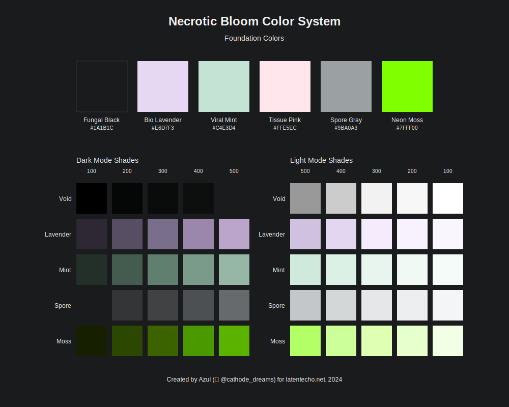

# Necrotic Bloom Color System



The official color system of Latent Echo, designed to provide semantic meaning through carefully calibrated color relationships while maintaining WCAG compliance across light and dark modes.

## Color Architecture

### Foundation Colors

| Color Name    | Hex Code | WCAG | Usage Context |
|--------------|----------|------|---------------|
| Fungal Black | `#1A1B1C` | AAA | Primary text, critical UI elements |
| Bio Lavender | `#E6D7F3` | AA  | Secondary elements, subtle highlights |
| Viral Mint   | `#C4E3D4` | AA  | Success states, positive indicators |
| Tissue Pink  | `#FFE5EC` | AA  | Warning states, attention indicators |
| Spore Gray   | `#9BA0A3` | AA  | Tertiary elements, disabled states |
| Neon Moss    | `#7FFF00` | AA  | Primary accent, interactive elements |

### Dark Mode Spectrum

| Color Name     | Hex Code | WCAG | Context Shift |
|---------------|----------|------|---------------|
| Deep Void     | `#0D0E0E` | AAA | Background surface |
| Dark Lavender | `#9B87AB` | AA  | Primary text, active states |
| Shadow Mint   | `#7A9B89` | AA  | Success indicators |
| Dark Spore    | `#4D5052` | AAA | Borders, separators |
| Dark Moss     | `#4B9900` | AA  | Interactive accents |

### Light Mode Spectrum

| Color Name      | Hex Code | WCAG | Context Shift |
|----------------|----------|------|---------------|
| Light Void     | `#F2F2F3` | AA  | Background surface |
| Light Lavender | `#F5EBFD` | AA  | Secondary backgrounds |
| Light Mint     | `#E8F5EE` | AA  | Success backgrounds |
| Light Spore    | `#E5E7E8` | AA  | Tertiary backgrounds |
| Light Moss     | `#DFFFB3` | AA  | Accent backgrounds |

## Implementation

### CSS Custom Properties

```css
:root {
    --fungal-black: #1A1B1C;
    --bio-lavender: #E6D7F3;
    --viral-mint: #C4E3D4;
    --tissue-pink: #FFE5EC;
    --spore-gray: #9BA0A3;
    --neon-moss: #7FFF00;
}

[data-theme="dark"] {
    --bg-color: var(--deep-void);
    --text-color: var(--dark-lavender);
    --accent: var(--shadow-mint);
}
```

### Semantic Usage

- Text Hierarchy: Use Fungal Black for primary content, Spore Gray for secondary
- Interactive States: Neon Moss for hover, Dark Moss for active
- System States: Viral Mint for success, Tissue Pink for warnings
- Background Layers: Light/Deep Void as base, Light variants for elevation

### Accessibility Notes

- All color combinations meet WCAG AA standards minimum
- Critical UI elements maintain AAA compliance
- Dark mode optimized for reduced eye strain
- Light mode ensures sufficient contrast ratios

## Attribution

Created by Azul ([cathodeDreams 𝕏](https://x.com/cathodeDreams)) for latentecho.net, 2024.
Last updated: 2024-11-18

